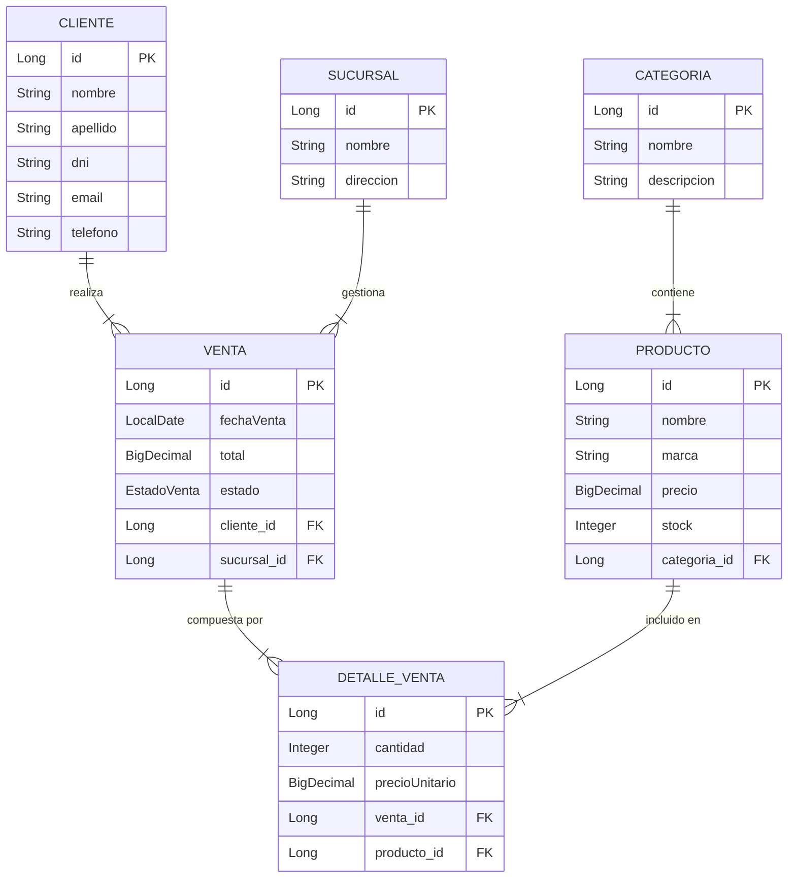

# 🛒 Tienda API - Spring Boot


[](./tienda_api_collection.json)

## 📖 Descripción del Proyecto

**Tienda API** es una solución backend robusta y escalable desarrollada con **Java** y **Spring Boot**, diseñada para gestionar integralmente la operatoria comercial de un negocio. La aplicación centraliza la administración de **productos, clientes, sucursales, categorías y ventas** a través de una interfaz RESTful estandarizada.

El desarrollo se centró en la creación de una arquitectura modular y mantenible, priorizando las buenas prácticas de diseño de software. Se implementó un sistema de persistencia optimizado mediante **Spring Data JPA** y un manejo eficiente de datos utilizando el patrón **DTO**, asegurando así el rendimiento y la seguridad en la transferencia de información.

### 🚀 Características Técnicas Destacadas

* **Arquitectura en Capas:** Separación estricta de responsabilidades (Controller, Service, Repository) para garantizar un código limpio, desacoplado y altamente testearle.
* **Patrón DTO (Data Transfer Object):** Implementación de objetos de transferencia para aislar las entidades de base de datos de la capa de presentación.
* **Java Streams API:** Uso de programación funcional para el procesamiento declarativo de colecciones y la transformación eficiente de datos (mapeo Entidad-DTO), reduciendo la complejidad ciclomática del código.
* **Excepciones Personalizadas y Global Handling:** Desarrollo de excepciones propias del dominio (Custom Exceptions) para manejar reglas de negocio específicas, para devolver respuestas HTTP consistentes y limpias.
* **API RESTful Estandarizada:** Diseño riguroso de endpoints respetando la semántica de los verbos HTTP (GET, POST, PUT, PATCH, DELETE).
* **Docker Ready:** Aplicación contenerizada para facilitar el despliegue en cualquier entorno.

## 🛠️ Tecnologías y Herramientas

* **Lenguaje:** Java 21 (LTS)
* **Framework:** Spring Boot 3.5.7
* **Base de Datos:** MySQL
* **Persistencia:** Spring Data JPA (Hibernate)
* **Librerías Adicionales:**
    * *Lombok:* Para reducción de código boilerplate.
    * *Maven:* Gestión de dependencias y ciclo de vida del proyecto.

## 🏗️ Arquitectura

El proyecto está organizado en los siguientes paquetes principales:

* `controller`: Puntos de entrada de la API REST.
* `service`: Lógica de negocio y transaccionalidad.
* `repository`: Capa de acceso a datos (Interfaces JPA).
* `model`: Entidades que reflejan el modelo relacional.
* `dto`: Objetos para transporte de datos entre capas.
* `mapper`: Lógica de conversión (Entidad <-> DTO).
* `exception`: Definición de excepciones personalizadas y manejador global de errores.

## 🧩 Modelo de Datos (DER)

Este diagrama representa la estructura de la base de datos y las relaciones entre las entidades del negocio:


## 🚀 Instalación y Ejecución Local

### Prerrequisitos
* Java JDK 21
* Maven
* MySQL Server

### Configuración

1.  **Clonar el repositorio:**
    ```bash
    git clone https://github.com/tu-usuario/tienda-api.git
    cd tienda-api
    ```

2.  **Base de Datos:**
    Crea una base de datos en MySQL llamada `tienda_base`.
    ```sql
    CREATE DATABASE tienda_base;
    ```

3.  **Variables de Entorno:**
    Verifica el archivo `src/main/resources/application.properties`.

4.  **Ejecutar la aplicación:**
    ```bash
    mvn spring-boot:run
    ```
    La API estará disponible en `http://localhost:9090`.

### 💾 Datos de Prueba (Seed Data)
El proyecto incluye un archivo `data.sql` que se ejecuta automáticamente al iniciar la aplicación. Esto precargará la base de datos con:
* 3 Categorías
* 2 Sucursales
* 2 Clientes
* 4 Productos
  Esto permite probar endpoints de ventas inmediatamente sin necesidad de cargar datos previos manualmente.

## 🐳 Ejecución con Docker

Si prefieres ejecutar la aplicación en un contenedor sin instalar Java/Maven localmente:

1.  **Construir la imagen:**
    ```bash
    docker build -t tienda-api .
    ```

2.  **Ejecutar el contenedor:**
    ```bash
    docker run -p 9090:9090 tienda-api
    ```

## 🧪 Testing y Pruebas

Para facilitar las pruebas de los endpoints, he incluido una colección de Postman lista para importar.

**Pasos para importar:**
1. Descarga el archivo `tienda_api_collection.json` haciendo clic en el botón de **Postman** (color naranja) que se encuentra en el encabezado de este documento.
2. Abre Postman.
3. Haz clic en **Import** (arriba a la izquierda).
4. Arrastra el archivo descargado.
5. ¡Listo! Tendrás una carpeta con todos los requests configurados para probar (GET, POST, PUT, DELETE).

## 🔌 Documentación de Endpoints

### 📦 Productos
| Método | Endpoint | Descripción |
| :--- | :--- | :--- |
| `GET` | `/api/productos` | Listar todos los productos |
| `GET` | `/api/productos/{id}` | Obtener detalle de un producto por ID |
| `POST` | `/api/productos` | Crear un nuevo producto |
| `PUT` | `/api/productos/{id}` | Actualizar un producto existente |
| `DELETE` | `/api/productos/{id}` | Eliminar un producto |

### 📂 Categorías
| Método | Endpoint | Descripción |
| :--- | :--- | :--- |
| `GET` | `/api/categorias` | Listar todas las categorías |
| `GET` | `/api/categorias/{id}` | Obtener detalle de una categoría por ID |
| `POST` | `/api/categorias` | Crear una nueva categoría |
| `PUT` | `/api/categorias/{id}` | Actualizar una categoría existente |
| `DELETE` | `/api/categorias/{id}` | Eliminar una categoría |

### 🧾 Ventas
| Método | Endpoint | Descripción |
| :--- | :--- | :--- |
| `GET` | `/api/ventas` | Listar historial de todas las ventas |
| `GET` | `/api/ventas/{id}` | Obtener detalle de una venta por ID |
| `POST` | `/api/ventas` | Registrar una nueva venta |
| `PATCH` | `/api/ventas/{id}/estado` | Actualizar el estado de una venta |

### 🏢 Sucursales
| Método | Endpoint | Descripción |
| :--- | :--- | :--- |
| `GET` | `/api/sucursales` | Listar todas las sucursales |
| `GET` | `/api/sucursales/{id}` | Obtener detalle de una sucursal por ID |
| `POST` | `/api/sucursales` | Registrar una nueva sucursal |
| `PUT` | `/api/sucursales/{id}` | Editar datos de una sucursal |
| `DELETE` | `/api/sucursales/{id}` | Eliminar una sucursal |

### 👥 Clientes
| Método | Endpoint | Descripción |
| :--- | :--- | :--- |
| `GET` | `/api/clientes` | Obtener listado de clientes |
| `GET` | `/api/clientes/{id}` | Obtener detalle de un cliente por ID |
| `POST` | `/api/clientes` | Registrar un nuevo cliente |
| `PUT` | `/api/clientes/{id}` | Actualizar información de cliente |
| `DELETE` | `/api/clientes/{id}` | Eliminar un cliente |

## 🔮 Próximos Pasos (Roadmap)
Aunque el proyecto cumple con los requerimientos funcionales, tengo planificadas las siguientes mejoras para escalar la aplicación:

- [ ] **Seguridad:** Implementar Spring Security y autenticación mediante JWT (JSON Web Tokens).
- [ ] **Testing:** Aumentar la cobertura de pruebas unitarias e integración con JUnit 5 y Mockito.
- [ ] **CI/CD:** Implementar un pipeline de integración continua con GitHub Actions.
- [ ] **Documentación:** Integrar Swagger/OpenAPI para documentación interactiva automática.

## ✒️ Autor

**Federico Frankenberger**

* **Rol:** Java Backend Developer
* **Email:** [fafrankenberger@gmail.com](mailto:fafrankenberger@gmail.com)
* **LinkedIn:** [Ver Perfil](https://www.linkedin.com/in/federico-agustin-frankenberger-5a348b240/)
* **GitHub:** [Ver Repositorio](https://github.com/Federico-Frankenberger)

---
© 2025 - Tienda API. Este proyecto es de uso educativo y forma parte de mi portafolio profesional.